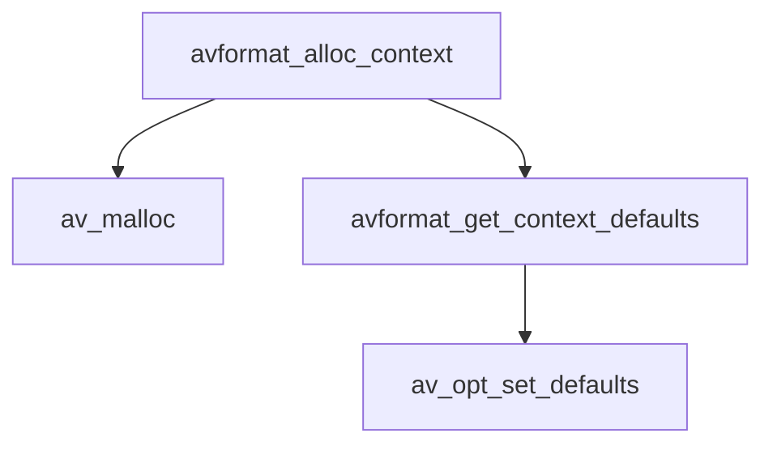
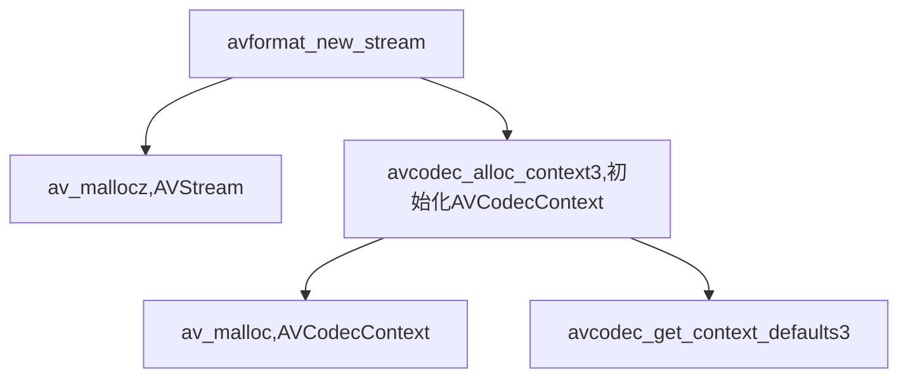
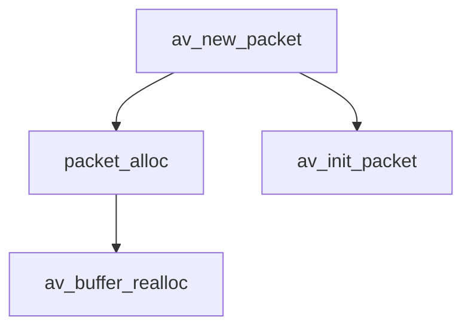

# AVFormatContext,AVFrame

https://blog.csdn.net/leixiaohua1020/article/details/41181155

ffmpeg常见结构体的初始化和销毁函数的源代码分析。

```
AVFormatContext:统领全局的基本结构体。主要用于处理封装格式（FLV/MKV/RMVB）
AVIOContext:输入输出对应的结构体，用于输入输出（读写文件，RTMP协议等）
AVStream，AVCodecContext：视音频流对应的结构体，用于视音频编解码。
AVFrame：存储非压缩的数据。RGB/YUV PCM
AVPacket：存储压缩数据。 H.264  AAC/MP3
```


结构体的初始化和销毁函数

| 结构体          | 初始化                                  | 销毁                    |
| --------------- | --------------------------------------- | ----------------------- |
| AVFormatContext | avformat_alloc_context()                | avformat_free_context() |
| AVIOContext     | avio_alloc_context()                    |                         |
| AVStream        | avformat_new_stream()                   |                         |
| AVCodecContext  | avcodec_alloc_context3()                |                         |
| AVFrame         | av_frame_alloc() av_image_fill_arrays() | av_frame_free()         |
| AVPacket        | av_init_packet() av_new_packet          | av_free_packet()        |


## AVFormatContext

```
AVFormatContext *avformat_alloc_context(void)
{
  AVFormatContext *ic;
  ic=av_malloc(sizeof(AVFormatContext));
  if(!ic) return ic;
  avformat_get_context_defaults(ic);//该函数用于设置AVFormatContext的字段的默认值。它的定义也位于libavformat\options.c
  
  ic->internal=av_mallocz(sizeof(*ic->internal));
  if(!ic->internal){
    avformat_free_context(ic);
    return NULL;
  }
  return ic;
}
```





## avformat_free_context()

函数调用了各式各样的销毁函数。av_opt_free(),av_freep(),av_dict_free(),释放不同种类的变量

另外还调用了一个释放AVStream的函数ff_free_stream().


## AVIOContext

### avio_alloc_context

avio_alloc_context()首先调用av_mallocz()为AVIOContext分配内存。而后调用了一个函数ffio_init_context()。该函数完成了真正的初始化工作。


## AVStream，AVCodecContext


AVStream的初始化函数是avformat_new_stream()，销毁函数使用销毁AVFormatContext的avformat_free_context()就可以了。

avformat_new_stream()首先调用av_mallocz()为AVStream分配内存。接着给新分配的AVStream的各个字段赋上默认值。然后调用了另一个函数avcodec_alloc_context3()初始化AVStream中的AVCodecContext。

avcodec_alloc_context3()首先调用av_malloc()为AVCodecContext分配存储空间，然后调用了一个函数avcodec_get_context_defaults3()用于设置该AVCodecContext的默认值。


函数调用结构图




## AVFrame

AVFrame的初始化函数是av_frame_alloc()，销毁函数是av_frame_free()。

av_frame_alloc()首先调用av_mallocz()为AVFrame结构体分配内存。而后调用了一个函数get_frame_defaults()用于设置一些默认参数。

```cpp
static void get_frame_defaults(AVFrame *frame)
{
    if (frame->extended_data != frame->data)
        av_freep(&frame->extended_data);
 
 
    memset(frame, 0, sizeof(*frame));
 
 
    frame->pts                   =
    frame->pkt_dts               =
    frame->pkt_pts               = AV_NOPTS_VALUE;
    av_frame_set_best_effort_timestamp(frame, AV_NOPTS_VALUE);
    av_frame_set_pkt_duration         (frame, 0);
    av_frame_set_pkt_pos              (frame, -1);
    av_frame_set_pkt_size             (frame, -1);
    frame->key_frame           = 1;
    frame->sample_aspect_ratio = (AVRational){ 0, 1 };
    frame->format              = -1; /* unknown */
    frame->extended_data       = frame->data;
    frame->color_primaries     = AVCOL_PRI_UNSPECIFIED;
    frame->color_trc           = AVCOL_TRC_UNSPECIFIED;
    frame->colorspace          = AVCOL_SPC_UNSPECIFIED;
    frame->color_range         = AVCOL_RANGE_UNSPECIFIED;
    frame->chroma_location     = AVCHROMA_LOC_UNSPECIFIED;
}

```


## AVPacket

AVPacket的初始化函数有两个：av_init_packet()，av_new_packet()。销毁函数是av_free_packet()。在初始化函数中av_init_packet()比较简单，初始化一些字段；而av_new_packet()相对“高级”一些，除了包含av_init_packet()的功能之外，还包含了AVPacket内部内存的分配。




