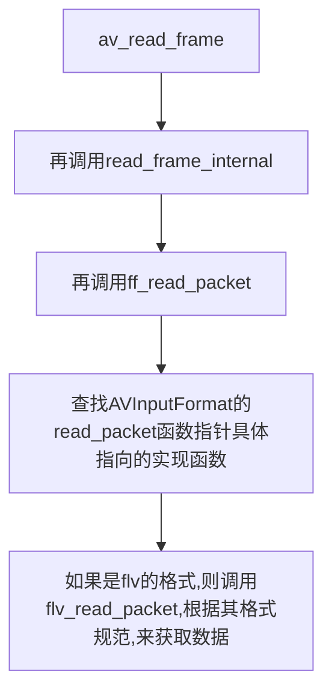

# av_read_frame()，获得的是压缩数据

<https://blog.csdn.net/leixiaohua1020/article/details/12678577>

函数的作用是读取码流中的音频若干帧或者视频一帧，例如，解码视频的时候，每解码一个视频帧，需要先调用av_read_frame（）获得一帧视频的压缩数据，然后才能对数据进行解码

位于libavformat/utils.c中

```
通过av_read_packet,读取一个包，需要说明的是此函数必须包含整数帧的，不存在半帧的情况，以ts流为例，是读取一个完整PES包（一个完整的pes包包含若干视频或音频es包），读取完毕后，通过av_parser_parse2()分析出视频一帧（或音频若干帧），返回，下次进入循环的时候，如果上次的数据没有完全取完，则st=s->cur_st;不会是NULL，即再此进入av_parser_parse2()流程，而不是下面的av_read_packet()流程，这样就保证了，如果读取一次包含了N帧视频数据，则调用av_read_frame()N次都不会去读数据，而是返回第一次读取的数据，直到全部解析完毕。
```

```cpp

int av_read_frame(AVFormatContext *s, AVPacket *pkt);
//s:输入
//pkt:输出的AVPacket

```

函数的作用是获取一个AVPacket

av_read_frame—新版本的ffmpeg用的是av_read_frame，老版本的是av_read_packet。

区别是av_read_packet读出的是包，它可能是半帧或多帧，不保证帧的完整性。

av_read_frame对av_read_packet进行了封装，使读出的数据总是完整的帧。


可以从源代码中看出，av_read_frame()调用了read_frame_internal()。

read_frame_internal()代码比较长，这里只简单看一下它前面的部分。它前面部分有2步是十分关键的：
（1）调用了ff_read_packet()从相应的AVInputFormat读取数据。

（2）如果媒体频流需要使用AVCodecParser，则调用parse_packet()解析相应的AVPacket。

下面我们分成分别看一下ff_read_packet()和parse_packet()的源代码。


ff_read_packet()中最关键的地方就是调用了AVInputFormat的read_packet()方法。AVInputFormat的read_packet()是一个函数指针，指向当前的AVInputFormat的读取数据的函数。在这里我们以FLV封装格式对应的AVInputFormat为例，看看read_packet()的实现函数是什么样子的。
FLV封装格式对应的AVInputFormat的定义位于libavformat\flvdec.c.


parse_packet()给需要AVCodecParser的媒体流提供解析AVPacket的功能。


流程图表示的是一种从上层到底层不断深入的关系





