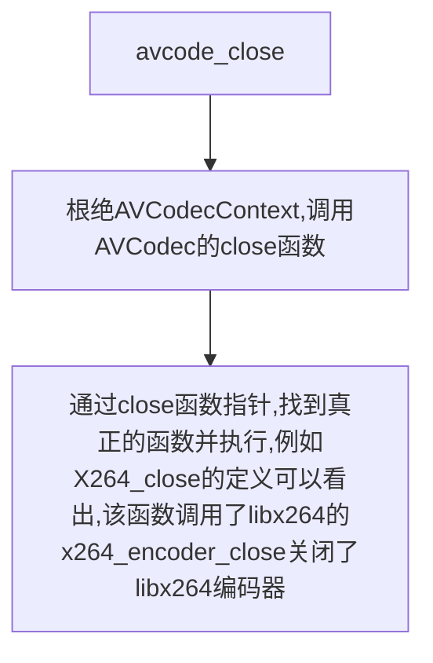

# avcode_close()

<https://blog.csdn.net/leixiaohua1020/article/details/44206699>

该函数用于关闭编码器。avcodec_close()函数的声明位于libavcodec\avcodec.h

```cpp

int avcodec_close(AVCodecContext *avctx);
```

输入参数，需要关闭的编码器AVCodecContext

该函数释放AVCodecContext中有关的变量，并且调用了AVCodec的close()关闭了解码器。



