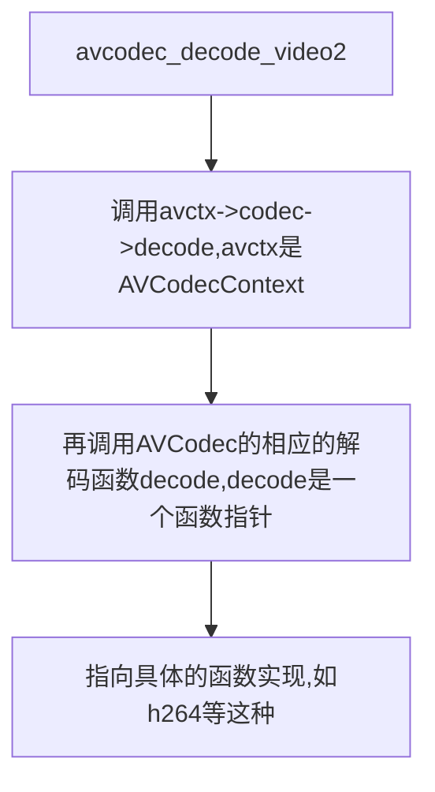

# avcodec_decode_video2()，avcodec_send_packet

从 FFmpeg 3.x 开始，avcodec_decode_video2 就被废弃了，取而代之的是 avcodec_send_packet 和 avcodec_receive_frame。

<https://www.jianshu.com/p/82784951d5b2>

其实avcodec_decode_video2也是调用这两个函数实现的


<https://blog.csdn.net/leixiaohua1020/article/details/12679719>

函数的作用是解码一帧视频数据，输入一个压缩编码的结构体AVPacket，输出一个解码后的结构体AVFrame。

声明位于libavcode/avcodec.h中。

```cpp
int avcodec_decode_video2(AVCodecContext *avctx, AVFrame *picture,
                         int *got_picture_ptr,
                         const AVPacket *avpkt);


```

```cpp
int attribute_align_arg avcodec_decode_video2(AVCodecContext *avctx, AVFrame *picture,
                                              int *got_picture_ptr,
                                              const AVPacket *avpkt)
{
    AVCodecInternal *avci = avctx->internal;
    int ret;
    // copy to ensure we do not change avpkt
    AVPacket tmp = *avpkt;
 
    if (!avctx->codec)
        return AVERROR(EINVAL);
    //检查是不是视频（非音频）
    if (avctx->codec->type != AVMEDIA_TYPE_VIDEO) {
        av_log(avctx, AV_LOG_ERROR, "Invalid media type for video\n");
        return AVERROR(EINVAL);
    }
 
    *got_picture_ptr = 0;
    //检查宽、高设置是否正确
    if ((avctx->coded_width || avctx->coded_height) && av_image_check_size(avctx->coded_width, avctx->coded_height, 0, avctx))
        return AVERROR(EINVAL);
 
    av_frame_unref(picture);
 
    if ((avctx->codec->capabilities & CODEC_CAP_DELAY) || avpkt->size || (avctx->active_thread_type & FF_THREAD_FRAME)) {
        int did_split = av_packet_split_side_data(&tmp);
        ret = apply_param_change(avctx, &tmp);
        if (ret < 0) {
            av_log(avctx, AV_LOG_ERROR, "Error applying parameter changes.\n");
            if (avctx->err_recognition & AV_EF_EXPLODE)
                goto fail;
        }
 
        avctx->internal->pkt = &tmp;
        if (HAVE_THREADS && avctx->active_thread_type & FF_THREAD_FRAME)
            ret = ff_thread_decode_frame(avctx, picture, got_picture_ptr,
                                         &tmp);
        else {
        	//最关键的解码函数
            ret = avctx->codec->decode(avctx, picture, got_picture_ptr,
                                       &tmp);
            //设置pkt_dts字段的值
            picture->pkt_dts = avpkt->dts;
 
            if(!avctx->has_b_frames){
                av_frame_set_pkt_pos(picture, avpkt->pos);
            }
            //FIXME these should be under if(!avctx->has_b_frames)
            /* get_buffer is supposed to set frame parameters */
            if (!(avctx->codec->capabilities & CODEC_CAP_DR1)) {
            	//对一些字段进行赋值
                if (!picture->sample_aspect_ratio.num)    picture->sample_aspect_ratio = avctx->sample_aspect_ratio;
                if (!picture->width)                      picture->width               = avctx->width;
                if (!picture->height)                     picture->height              = avctx->height;
                if (picture->format == AV_PIX_FMT_NONE)   picture->format              = avctx->pix_fmt;
            }
        }
        add_metadata_from_side_data(avctx, picture);
 
fail:
        emms_c(); //needed to avoid an emms_c() call before every return;
 
        avctx->internal->pkt = NULL;
        if (did_split) {
            av_packet_free_side_data(&tmp);
            if(ret == tmp.size)
                ret = avpkt->size;
        }
 
        if (*got_picture_ptr) {
            if (!avctx->refcounted_frames) {
                int err = unrefcount_frame(avci, picture);
                if (err < 0)
                    return err;
            }
 
            avctx->frame_number++;
            av_frame_set_best_effort_timestamp(picture,
                                               guess_correct_pts(avctx,
                                                                 picture->pkt_pts,
                                                                 picture->pkt_dts));
        } else
            av_frame_unref(picture);
    } else
        ret = 0;
 
    /* many decoders assign whole AVFrames, thus overwriting extended_data;
     * make sure it's set correctly */
    av_assert0(!picture->extended_data || picture->extended_data == picture->data);
 
#if FF_API_AVCTX_TIMEBASE
    if (avctx->framerate.num > 0 && avctx->framerate.den > 0)
        avctx->time_base = av_inv_q(av_mul_q(avctx->framerate, (AVRational){avctx->ticks_per_frame, 1}));
#endif
 
    return ret;
}

```

从代码中可以看出，avcodec_decode_video2()主要做了以下几个方面的工作：

（1）对输入的字段进行了一系列的检查工作：例如宽高是否正确，输入是否为视频等等。

（2）通过ret = avctx->codec->decode(avctx, picture, got_picture_ptr,&tmp)这句代码，调用了相应AVCodec的decode()函数，完成了解码操作。

（3）对得到的AVFrame的一些字段进行了赋值，例如宽高、像素格式等等。

其中第二部是关键的一步，它调用了AVCodec的decode()方法完成了解码。AVCodec的decode()方法是一个函数指针，指向了具体解码器的解码函数。在这里我们以H.264解码器为例，看一下解码的实现过程。H.264解码器对应的AVCodec的定义位于libavcodec\h264.c，如下所示。

```cpp
AVCodec ff_h264_decoder = {
    .name                  = "h264",
    .long_name             = NULL_IF_CONFIG_SMALL("H.264 / AVC / MPEG-4 AVC / MPEG-4 part 10"),
    .type                  = AVMEDIA_TYPE_VIDEO,
    .id                    = AV_CODEC_ID_H264,
    .priv_data_size        = sizeof(H264Context),
    .init                  = ff_h264_decode_init,
    .close                 = h264_decode_end,
    .decode                = h264_decode_frame,
    .capabilities          = /*CODEC_CAP_DRAW_HORIZ_BAND |*/ CODEC_CAP_DR1 |
                             CODEC_CAP_DELAY | CODEC_CAP_SLICE_THREADS |
                             CODEC_CAP_FRAME_THREADS,
    .flush                 = flush_dpb,
    .init_thread_copy      = ONLY_IF_THREADS_ENABLED(decode_init_thread_copy),
    .update_thread_context = ONLY_IF_THREADS_ENABLED(ff_h264_update_thread_context),
    .profiles              = NULL_IF_CONFIG_SMALL(profiles),
    .priv_class            = &h264_class,
};

```



