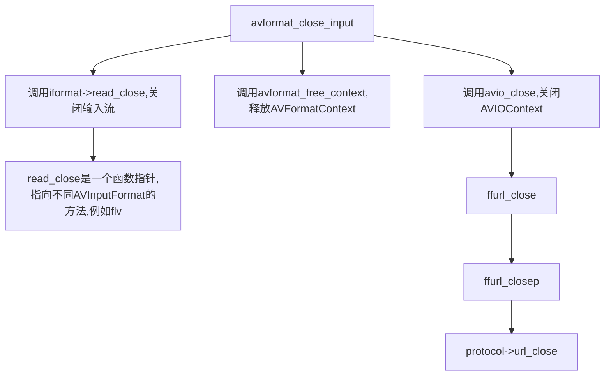
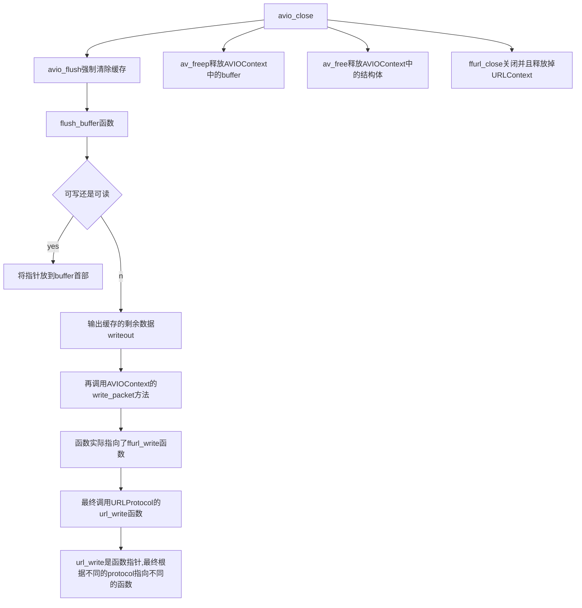

# avformat_close_input()

<https://blog.csdn.net/leixiaohua1020/article/details/44110683>

该函数用于关闭一个AVFormatContext，一般情况下适合avformat_open_input()成对使用的。

函数位于libavformat/avformat.h中

```cpp
void avformat_close_input(AVFormatContext **s);
```

函数主要做了以下几步工作

```
1、调用AVInputFormat的read_close()方法关闭输入流
2、调用avformat_free_context()释放AVFormatContext
3、调用avio_close()关闭并且释放AVIOContext
```


## AVInputFormat->read_close()

它是一个函数指针，指向关闭输入流的函数，不同的AVInputFormat包含不同的read_close方法。

如flv，有其对应的函数

```cpp

AVInputFormat ff_flv_demuxer = {
    .name           = "flv",
    .long_name      = NULL_IF_CONFIG_SMALL("FLV (Flash Video)"),
    .priv_data_size = sizeof(FLVContext),
    .read_probe     = flv_probe,
    .read_header    = flv_read_header,
    .read_packet    = flv_read_packet,
    .read_seek      = flv_read_seek,
    .read_close     = flv_read_close,
    .extensions     = "flv",
    .priv_class     = &flv_class,
};

```

## avformat_free_context

avformat_free_context()是一个FFmpeg的API函数，用于释放一个AVFormatContext。在这里要注意搞清楚avformat_free_context()和avformat_close_input()之间的区别与联系。
有关avformat_free_context()

## avio_close()

avio_close()是一个FFmpeg的API函数，用于关闭和释放AVIOContext。它的声明位于libavformat\avio.h，如下所示。

```
1、调用avio_flush()强制清除缓存中的数据
2、调用av_freep()释放掉AVIOContext中的buffer
3、调用av_free()释放掉AVIOContext结构体
4、调用ffurl_close()关闭并且释放掉URLContext
```


## avio_flush

avio_flush是一个ffmpeg的API函数，声明位于libavformat/avio.h。

函数调用了flush_buffer()函数。

从flush_buffer()定义可知，该函数将当前缓存指针buf_ptr的位置重新设置到缓存buffer的首部，然后根据AVIOContext对应的流是否可写分别做不同的处理。

然后是只读，就将混存的尾部buf_end设定到缓存首部位置。

如果AVIOContext对应的流式可写的（write_flag取值非0），则会调用writeout（）函数输出缓存中剩余的数据


writeout()调用了AVIOContext的write_packet()方法，而该函数实际指向了ffurl_write()函数。

ffurl_write()经过retry_transfer_wrapper()函数最终调用了URLProtocol的url_write（）函数，url_write()是一个函数指针，不同的URLProtocol的url_write()指向不同的函数。

举例，ff_file_protocol中的url_write()指向的是file_write（）函数，而该函数又调用了系统的write()函数。


## ffurl_close()和ffurl_closep()

ffurl_close()和ffurl_closep()是FFmpeg内部的两个函数，它们的声明位于libavformat\url.h。

ffurl_close()调用了ffurl_closep()。

ffurl_closep（）的工作主要有：

```
1、调用URLProtocol的url_close()
2、调用av_freep()释放URLContext结构体
```

其中URLProtocol的url_close()是一个函数指针，其指向的函数与具体的URLProtocol有关，


## 调用关系图







