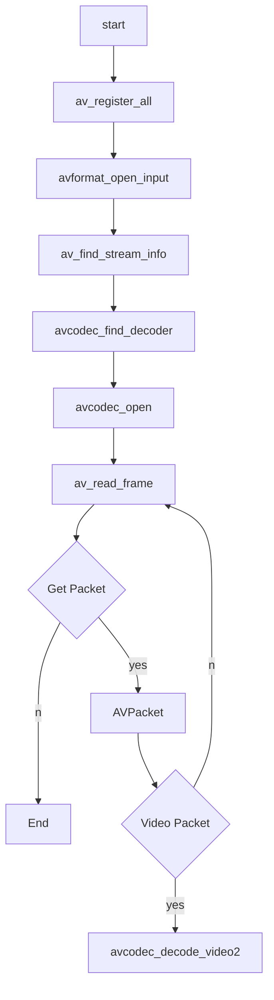

# ffmpeg解码

[TOC]


## 流程图




```cpp
int main(int argc,char* argv[])
{
  AVFormatContext *pFormatCtx;
  int i,videoindex;
  
  AVCodecContext *pCodecCtx;
  AVCodec *pCodec;
  AVFrame *pFrame,*pFrameYUV;
  unsigned char* out_buffer;
  AVPacket *packet;
  
  int y_size;
  int ret,got_picture;
  
  char filepath[]="bigbuckbunny_480*272.h265";
  
  FILE *fp_yuv;
  
  av_register_all();
  avformat_network_init();
  pFormatCtx=avformat_alloc_context();
  
  if(avformat_open_input(&pFormatCtx,filepath,NULL,NULL)!=0){
		printf("Couldn't open input stream.\n");
		return -1;
	}
	if(avformat_find_stream_info(pFormatCtx,NULL)<0){
		printf("Couldn't find stream information.\n");
		return -1;
	}

	videoindex=-1;
  for(i=0;i<pFormatCtx->nb_streams;i++)
  {
    if(pFormatCtx->streams[i]->codec->codec_type==AVMEDIA_TYPE_VIDEO){
      videoindex=i;
      break;
    }
    
  }
  
  if(videoindex==-1){
		printf("Didn't find a video stream.\n");
		return -1;
	}

  pCodecCtx=pFormatCtx->streams[videoindex]->codec;
  pCodec=avcodec_find_decoder(pCodecCtx->codec_id);
  
  if(pCodec==NULL){
    printf("codec not found.\n");
    return -1;
    
  }
  
  if(avcodec_open2(pCodecCtx,pCodec,NULL)<0){
    printf("could not open codec.\n");
    return -1;
  }
  
  pFrame=av_frame_alloc();
  pFrameYUV=av_frame_alloc();
  out_buffer=(unsigned char*)av_malloc(av_image_get_buffer_size(AV_PIX_FMT_YUV420P,  pCodecCtx->width, pCodecCtx->height,1));
  av_image_fill_arrays(pFrameYUV->data, pFrameYUV->linesize,out_buffer,
		AV_PIX_FMT_YUV420P,pCodecCtx->width, pCodecCtx->height,1);
	
	packet=(AVPacket *)av_malloc(sizeof(AVPacket));

//.....
}
```


