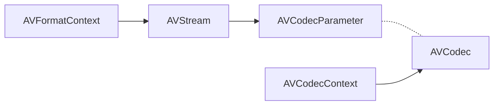
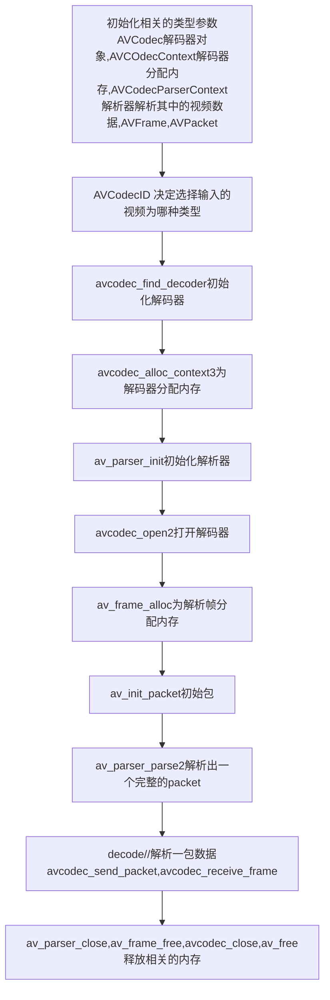

##### 视频编解码


基础结构见图片   解复用名词解释.png

- ffmpeg

  具体的流程如下：

  1、注册 av_register_all ，用于使用复用器，编码器等*

  2、文件打开，avformat_open_input,该方法完成了媒体文件的打开和格式探测功能*

  3、数据读取 av_read_frame作用是读取媒体数据中的每个音视频帧*

```c++
char *url="http://192.168.1.105/test.flv";
AVPacket pkt;//编解码后的压缩包
int ret=0;

//注册复用器、编码器等
av_register_all();
avformat_network_init();

//打开文件
AVFormatContext *fmtCtx=avformat_alloc_context();
ret=avformat_open_input(&fmtCtx,url,NULL,NULL);
ret=avformat_find_stream_info(fmtCtx,NULL);

//读取音视频数据
while(ret>=0){
    ret=av_read_frame(s,&pkt);
}
```


- 解码可以选择cpu（ffmpeg）或者gpu（nvidia coder）

以ffmpeg解码为例，见decode.cpp

流程图如下：




程序流程图




- 编码


- 解复用

  ```mermaid
  graph TD
  id1[解封装avformat_open_input]-->id2[avformat_find_stream_info]
  id2-->id3[av_dump_format打印相关信息]
  id3-->id4[解码avcodec_find_decoder]
  id4-->id5[avcodec_alloc_context3]
  id5-->id6[avcodec_parameters_to_context获取上下文参数]
  id6-->id7[avcodec_open2打开解码器]
  id7-->id8[av_frame_alloc,av_image_get_buffer_size,av_image_fill_arrays]
  id8-->id9[sws_getContext图像色彩空间转换]
  id9-->id10[av_read_frame,avcodec_send_packet,avcodec_receive_frame]
  id10-->id11[sws_scale]
  id11-->id12[saveFrame]
  id12-->id13[av_packet_unref,av_free,av_frame_free,av_frame_free,avcodec_close,avformat_close_input]
  
  ```

  


- 参考

  参考博客*https://www.jianshu.com/p/e354f6f55d16

  参考代码<https://note.youdao.com/ynoteshare1/index.html?id=6f54c7d9d0ec4c0eea2366bf5b176e2b&type=notebook>

